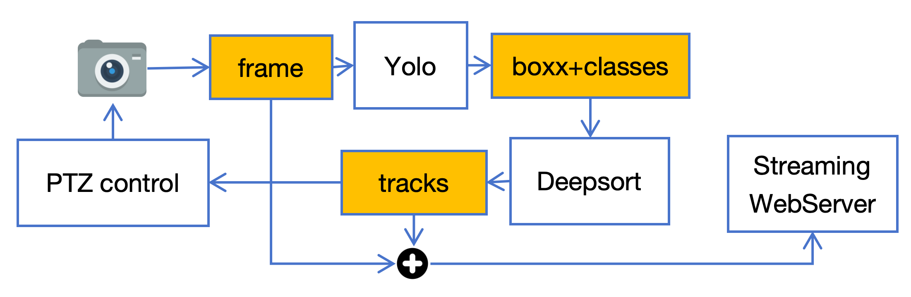
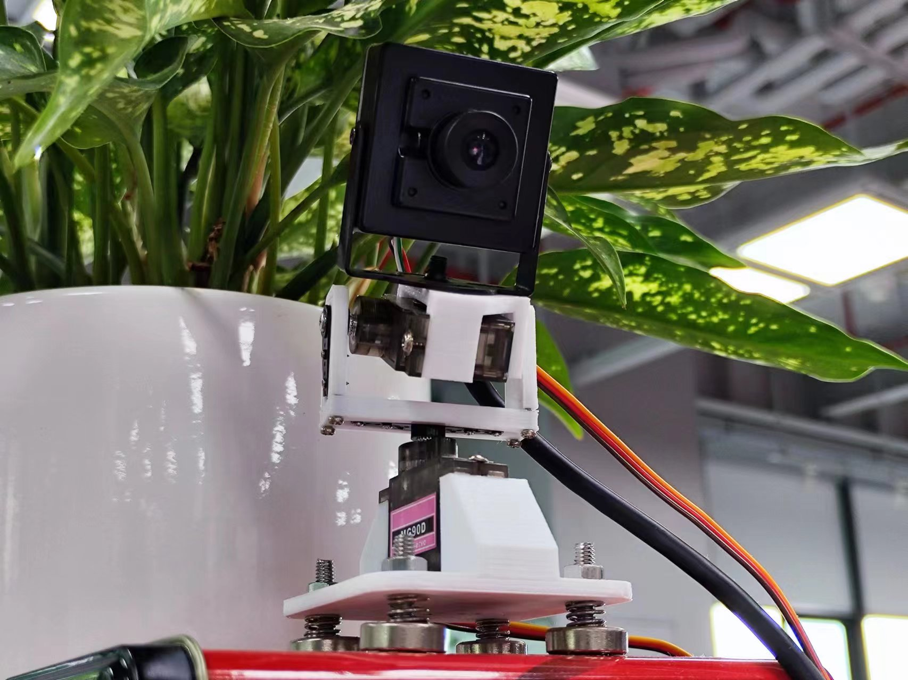
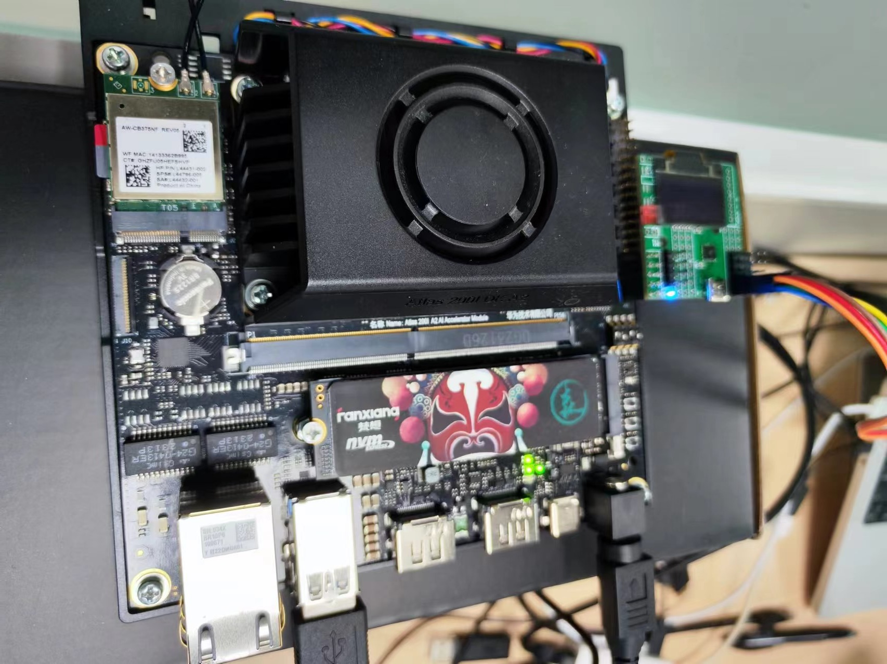
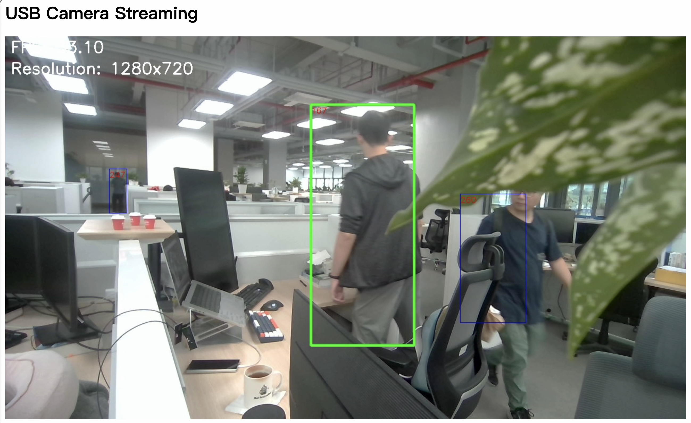

# target-recognition-ptz
YoloV5 + deep sort + 2-axis-PTZ + Ascend 310 NPU

 

### 模型转换

- om离线模型是华为Ascend 310b NPU 专用的模型格式，项目代码中推理使用的是ait库，使用简单，但是效率较低。

- 使用atc转换mobilenet模型，convert_embedder_model/convert_mobilenetv2.ipynb
方案：pytorch -> onnx -> om		但存在精度损失。

### 目标跟踪
- 目标跟踪算法使用deepsort，Reid模型使用mobilenetv2，去除了最后classify层，只提取目标图像的特征。

- embeder是Reid的提取特征的类，新增代码embedder_npu是Ascend 310b NPU 的embeder实现，使用ait库ais进行推理。

### 摄像头图像处理
- 使用opencv读取USB摄像头图像。
- 使用HTTPServer作为视频流服务器。

 
舵机云台+USB摄像头
 
Atlas 200I DK A2 + 外挂舵机控制板
 
YoloV5 + deepsort+云台追随

项目地址：
[IGB-Logistics/target-recognition-ptz: YoloV5 + deep sort + 2-axis-PTZ + Ascend 310 NPU (github.com)](https://github.com/IGB-Logistics/target-recognition-ptz)

NPU推理工具：
[ait/components/benchmark/README.md · Ascend/ ait - Gitee.com](https://gitee.com/ascend/ait/blob/master/ait/components/benchmark/README.md#ais_bench%E6%8E%A8%E7%90%86%E5%B7%A5%E5%85%B7%E4%BD%BF%E7%94%A8%E6%8C%87%E5%8D%97)

deepsort代码：
[levan92/deep_sort_realtime: A really more real-time adaptation of deep sort (github.com)](https://github.com/levan92/deep_sort_realtime)

多目标跟踪：
[多目标跟踪（MOT）入门 - 知乎 (zhihu.com)](https://zhuanlan.zhihu.com/p/97449724)